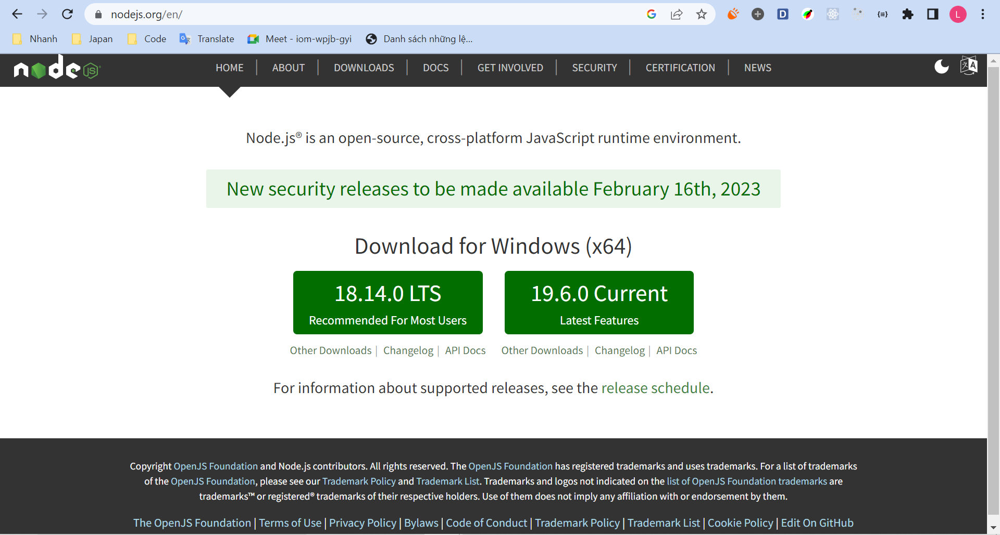
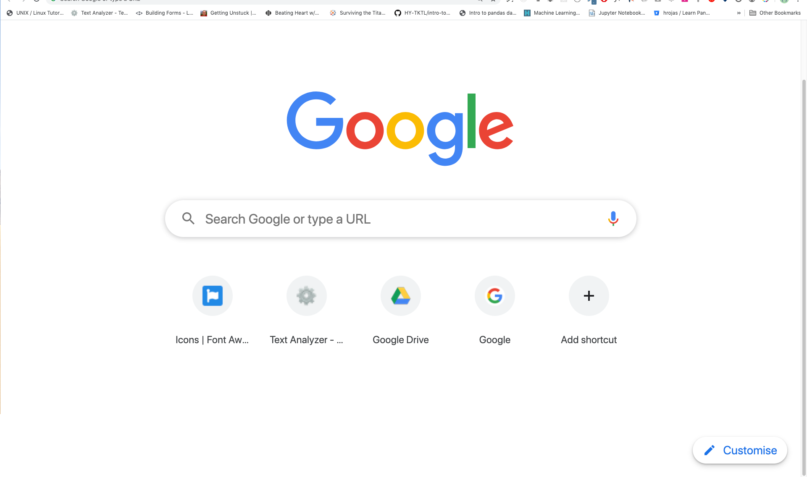
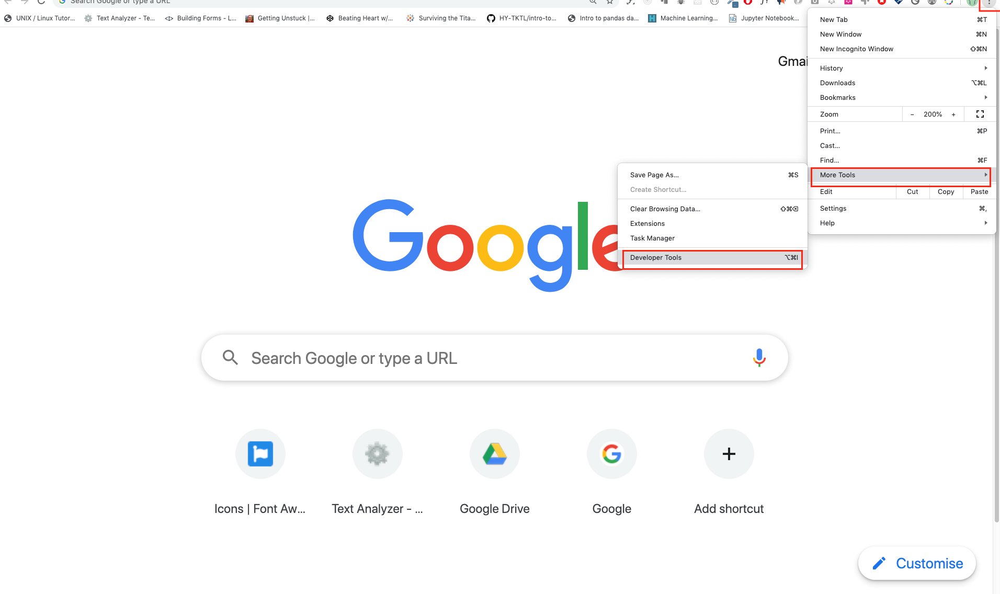
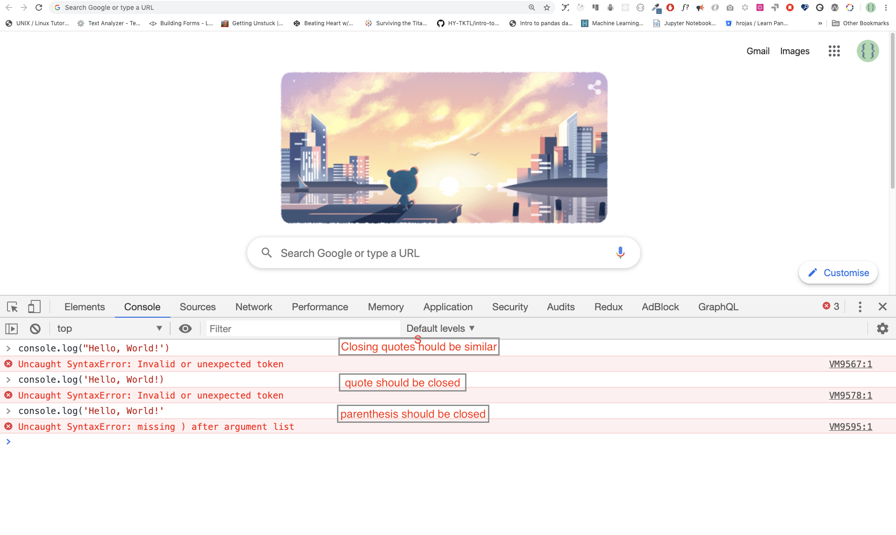
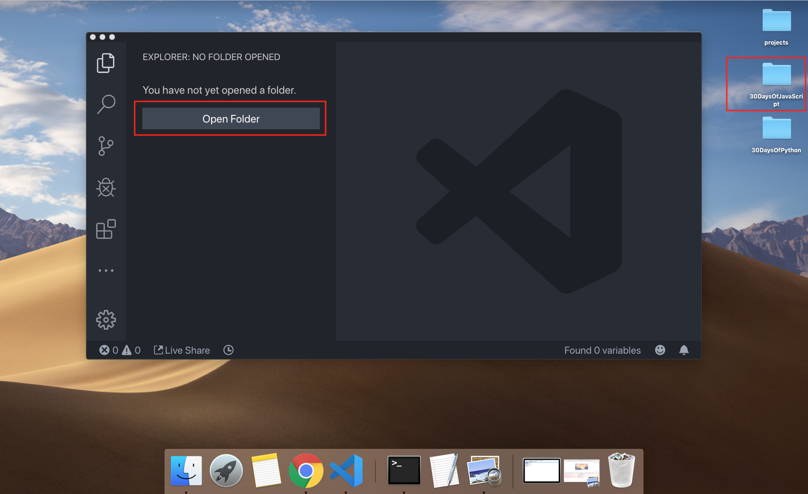
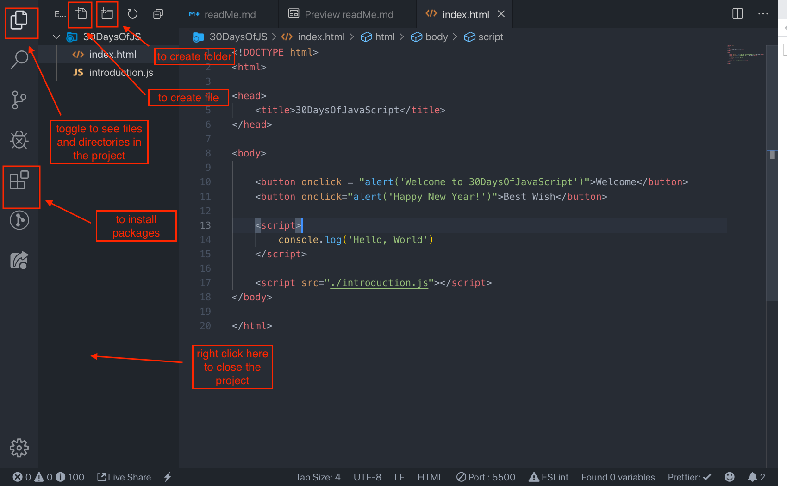

# 30 Days Of JavaScript

| # Day |                                                                       Topics                                                                        |
| ----- | :-------------------------------------------------------------------------------------------------------------------------------------------------: |
| 01    |                                                             [Introduction](./readMe.md)                                                             |
| 02    |                                               [Data Types](./02_Day_Data_types/02_day_data_types.md)                                                |
| 03    |                             [Booleans, Operators, Date](./03_Day_Booleans_operators_date/03_booleans_operators_date.md)                             |
| 04    |                                            [Conditionals](./04_Day_Conditionals/04_day_conditionals.md)                                             |
| 05    |                                                     [Arrays](./05_Day_Arrays/05_day_arrays.md)                                                      |
| 06    |                                                       [Loops](./06_Day_Loops/06_day_loops.md)                                                       |
| 07    |                                                 [Functions](./07_Day_Functions/07_day_functions.md)                                                 |
| 08    |                                                    [Objects](./08_Day_Objects/08_day_objects.md)                                                    |
| 09    |                             [Higher Order Functions](./09_Day_Higher_order_functions/09_day_higher_order_functions.md)                              |
| 10    |                                           [Sets and Maps](./10_Day_Sets_and_Maps/10_day_Sets_and_Maps.md)                                           |
| 11    |                      [Destructuring and Spreading](./11_Day_Destructuring_and_spreading/11_day_destructuring_and_spreading.md)                      |
| 12    |                                  [Regular Expressions](./12_Day_Regular_expressions/12_day_regular_expressions.md)                                  |
| 13    |                             [Console Object Methods](./13_Day_Console_object_methods/13_day_console_object_methods.md)                              |
| 14    |                                         [Error Handling](./14_Day_Error_handling/14_day_error_handling.md)                                          |
| 15    |                                                    [Classes](./15_Day_Classes/15_day_classes.md)                                                    |
| 16    |                                                        [JSON](./16_Day_JSON/16_day_json.md)                                                         |
| 17    |                                            [Web Storages](./17_Day_Web_storages/17_day_web_storages.md)                                             |
| 18    |                                                  [Promises](./18_Day_Promises/18_day_promises.md)                                                   |
| 19    |                                                   [Closure](./19_Day_Closures/19_day_closures.md)                                                   |
| 20    |                                  [Writing Clean Code](./20_Day_Writing_clean_codes/20_day_writing_clean_codes.md)                                   |
| 21    |                                                          [DOM](./21_Day_DOM/21_day_dom.md)                                                          |
| 22    |                            [Manipulating DOM Object](./22_Day_Manipulating_DOM_object/22_day_manipulating_DOM_object.md)                            |
| 23    |                                        [Event Listeners](./23_Day_Event_listeners/23_day_event_listeners.md)                                        |
| 24    |                             [Mini Project: Solar System](./24_Day_Project_solar_system/24_day_project_solar_system.md)                              |
| 25    | [Mini Project: World Countries Data Visulalization 1](./25_Day_World_countries_data_visualization_1/25_day_world_countries_data_visualization_1.md) |
| 26    | [Mini Project: World Countries Data Visulalization 2](./26_Day_World_countries_data_visualization_2/26_day_world_countries_data_visualization_2.md) |
| 27    |                             [Mini Project: Portfolio](./27_Day_Mini_project_portfolio/27_day_mini_project_portfolio.md)                             |
| 28    |                          [Mini Project: Leaderboard](./28_Day_Mini_project_leaderboard/28_day_mini_project_leaderboard.md)                          |
| 29    |             [Mini Project:Animating characters](./29_Day_Mini_project_animating_characters/29_day_mini_project_animating_characters.md)             |
| 30    |                                     [Final Projects](./30_Day_Mini_project_final/30_day_mini_project_final.md)                                      |

🧡🧡🧡 HAPPY CODING 🧡🧡🧡

<div align="center">
  <h1> 30 Days Of JavaScript: Introduction</h1>
<sub>Author:
<a href="https://www.facebook.com/tung.lexuan.33449138/" target="_blank">TungLx</a><br>
<small> January, 2022</small>
</sub>
</div>

[Day 2 >>](./02_Day_Data_types/02_day_data_types.md)


- [30 Days Of JavaScript](#30-days-of-javascript)
- [📔 Day 1](#-day-1)
  - [Introduction](#introduction)
  - [Requirements](#requirements)
  - [Setup](#setup)
    - [Install Node.js](#install-nodejs)
    - [Browser](#browser)
      - [Installing Google Chrome](#installing-google-chrome)
      - [Opening Google Chrome Console](#opening-google-chrome-console)
      - [Writing Code on Browser Console](#writing-code-on-browser-console)
        - [Console.log](#consolelog)
        - [Console.log with Multiple Arguments](#consolelog-with-multiple-arguments)
        - [Comments](#comments)
        - [Syntax](#syntax)
      - [Arithmetics](#arithmetics)
    - [Code Editor](#code-editor)
      - [Installing Visual Studio Code](#installing-visual-studio-code)
      - [How to Use Visual Studio Code](#how-to-use-visual-studio-code)
  - [Adding JavaScript to a Web Page](#adding-javascript-to-a-web-page)
    - [Inline Script](#inline-script)
    - [Internal Script](#internal-script)
    - [External Script](#external-script)
    - [Multiple External Scripts](#multiple-external-scripts)
  - [Introduction to Data types](#introduction-to-data-types)
    - [Numbers](#numbers)
    - [Strings](#strings)
    - [Booleans](#booleans)
    - [Undefined](#undefined)
    - [Null](#null)
  - [Checking Data Types](#checking-data-types)
  - [Comments Again](#comments-again)
  - [Variables](#variables)
- [💻 Day 1: Exercises](#-day-1-exercises)

# 📔 Day 1

## Introduction

**Chúc mừng** bạn đã quyết định tham gia thử thách lập trình JavaScript trong 30 ngày. Trong thử thách này, bạn sẽ học mọi thứ cần thiết để trở thành một lập trình viên JavaScript và nói chung là toàn bộ khái niệm về lập trình. Khi kết thúc thử thách, bạn sẽ nhận được chứng chỉ hoàn thành thử thách lập trình 30DaysJavaScript.

## Setup

Tôi tin rằng bạn có động lực và mong muốn mạnh mẽ trở thành nhà phát triển máy tính và Internet. Nếu bạn có những thứ đó, thì bạn có mọi thứ để bắt đầu.

### Install Node.js

Cài đặt Nodejs. Install [node.js](https://nodejs.org/en/).



Sau khi tải về click đúp và cài đặt theo hướng dẫn.

Chúng ta có thể kiểm tra xem Nodejs đã được cài đặt trên máy của mình hay không bằng cách mở
terminal hoặc command prompt.

```sh
$ node -v
v18.14.0
```

### Browser

Có rất nhiều trình duyệt ngoài kia. Tuy nhiên, tôi thực sự khuyên dùng Google Chrome.

#### Installing Google Chrome

Cài đặt [google chrome](https://www.google.com/chrome/) nếu bạn chưa có. Chúng tôi có thể viết mã JavaScript cơ bản trên bảng điều khiển trình duyệt, nhưng chúng tôi không sử dụng bảng điều khiển trình duyệt để phát triển ứng dụng.


#### Opening Google Chrome Console

Bạn có thể mở bảng điều khiển Google Chrome bằng cách nhấp vào ba dấu chấm ở góc trên cùng bên phải của trình duyệt, chọn _More tools -> Developer tools_ hoặc sử dụng phím tắt. Tôi thích sử dụng phím tắt hơn.



Để mở bảng điều khiển Chrome bằng phím tắt.

```sh
Mac
Command+Option+J

Windows/Linux:
Ctl+Shift+J
```


After you open the Google Chrome console, try to explore the marked buttons. We will spend most of the time on the Console. The Console is the place where your JavaScript code goes. The Google Console V8 engine changes your JavaScript code to machine code.
Let us write a JavaScript code on the Google Chrome console:

Sau khi bạn mở bảng điều khiển Google Chrome, hãy thử khám phá các nút được đánh dấu. Chúng tôi sẽ dành phần lớn thời gian cho Bảng điều khiển. Bảng điều khiển là nơi chứa JavaScript của bạn. Công cụ Google Console V8 thay đổi JavaScript của bạn thành mã máy. Hãy để chúng tôi viết JavaScript trên bảng điều khiển Google Chrome:


#### Writing Code on Browser Console

Chúng tôi có thể viết bất kỳ mã JavaScript nào trên bảng điều khiển Google hoặc bất kỳ bảng điều khiển trình duyệt nào. Tuy nhiên, đối với thử thách này, chúng tôi chỉ tập trung vào bảng điều khiển Google Chrome. Mở bảng điều khiển bằng cách sử dụng:

```sh
Mac
Command+Option+I

Windows:
Ctl+Shift+I
```

##### Console.log

Để viết mã JavaScript đầu tiên của mình, chúng tôi đã sử dụng hàm tích hợp sẵn **console.log()**. Chúng tôi đã chuyển một đối số làm dữ liệu đầu vào và hàm hiển thị đầu ra. Chúng tôi đã chuyển 'Hello, World' làm dữ liệu đầu vào hoặc đối số trong hàm console.log().

```js
console.log("Hello, World!");
```

##### Console.log with Multiple Arguments

Hàm **conole.log()** có thể nhận nhiều tham số được phân tách bằng dấu phẩy. Cú pháp như sau:**console.log(param1, param2, param3)**


```js
console.log("Hello", "World", "!");
console.log("HAPPY", "NEW", "YEAR", 2023);
console.log("Welcome", "to", 30, "Days", "JavaScript");
```

Như bạn có thể thấy từ đoạn mã trên, _console.log()_ có thể nhận nhiều đối số.

Chúc mừng! Bạn đã viết mã JavaScript đầu tiên của mình bằng _console.log()_.

##### Comments

Comment trong JavaScript (hay còn gọi là chú thích) là gợi ý mà một lập trình viên có thể thêm vào để làm cho mã của họ dễ đọc và dễ hiểu hơn. Chúng hoàn toàn bị bỏ qua bởi các công cụ của JavaScript như trình thông dịch, biên dịch,…

**Example: Single Line Comment**

// This is the first comment  
 // This is the second comment  
 // I am a single line comment

**Example: Multiline Comment**

/_
This is a multiline comment  
 Multiline comments can take multiple lines  
 JavaScript is the language of the web  
 _/

##### Syntax

Ngôn ngữ lập trình tương tự như ngôn ngữ của con người. Tiếng Anh hay nhiều ngôn ngữ khác sử dụng từ, cụm từ, câu, câu ghép và nhiều ngôn ngữ khác để truyền đạt một thông điệp có ý nghĩa. Ý nghĩa tiếng Anh của cú pháp là sự sắp xếp các từ và cụm từ để tạo ra các câu được hình thành tốt trong một ngôn ngữ. Định nghĩa kỹ thuật của cú pháp là cấu trúc của các câu lệnh trong ngôn ngữ máy tính. Ngôn ngữ lập trình có cú pháp. JavaScript là một ngôn ngữ lập trình và giống như các ngôn ngữ lập trình khác, nó có cú pháp riêng. Nếu chúng ta không viết một cú pháp mà JavaScript hiểu được, nó sẽ phát sinh các loại lỗi khác nhau. Chúng ta sẽ khám phá các loại lỗi JavaScript khác nhau sau. Bây giờ, chúng ta hãy xem các lỗi cú pháp.



Chúng ta đã thấy cách hiển thị văn bản bằng _console.log()_. Nếu chúng ta đang in văn bản hoặc chuỗi bằng _console.log()_, văn bản phải nằm trong dấu ngoặc đơn hoặc dấu ngoặc kép.
**Ví dụ:**

```js
console.log("Hello, World!");
console.log("Hello, World!");
console.log(`Hello, World!`);
```

#### Arithmetics

Bây giờ, chúng ta hãy thực hành viết mã JavaScript nhiều hơn bằng cách sử dụng _console.log()_ trên bảng điều khiển google chrome cho các loại dữ liệu số. Ngoài văn bản, chúng ta cũng có thể thực hiện các phép tính toán học bằng JavaScript. Hãy để chúng tôi làm các tính toán đơn giản sau đây. Bàn điều khiển có thể trực tiếp lấy đối số mà không cần hàm _console.log()_. Tuy nhiên, nó được bao gồm trong phần giới thiệu này vì hầu hết thử thách này sẽ diễn ra trong trình soạn thảo văn bản nơi việc sử dụng chức năng này là bắt buộc.


```js
console.log(2 + 3); // Addition
console.log(3 - 2); // Subtraction
console.log(2 * 3); // Multiplication
console.log(3 / 2); // Division
console.log(3 % 2); // Modulus - finding remainder
console.log(3 ** 2); // Exponentiation 3 ** 2 == 3 * 3
```

### Code Editor

Chúng tôi có thể viết mã của mình trên bảng điều khiển trình duyệt, nhưng điều đó sẽ không phù hợp với các dự án lớn hơn. Trong môi trường làm việc thực tế, các nhà phát triển sử dụng các trình soạn thảo mã khác nhau để viết mã của họ. Trong thử thách JavaScript 30 ngày này, chúng tôi sẽ sử dụng Visual Studio Code.

#### Installing Visual Studio Code

Visual studio code là một trình soạn thảo văn bản mã nguồn mở rất phổ biến. Tôi khuyên bạn nên [download Visual Studio Code](https://code.visualstudio.com/).


Nếu bạn đã cài đặt Visual Studio Code, hãy bắt đầu sử dụng nó.

#### How to Use Visual Studio Code

Mở Visual Studio Code bằng cách nhấp đúp vào biểu tượng của nó. Khi bạn mở nó, bạn sẽ nhận được loại giao diện này. Cố gắng tương tác với các biểu tượng được dán nhãn.








## Adding JavaScript to a Web Page

JavaScript có thể được thêm vào một trang web theo ba cách khác nhau:

- **_Inline script_**
- **_Internal script_**
- **_External script_**
- **_Multiple External scripts_**

Các phần sau hiển thị các cách khác nhau để thêm mã JavaScript vào trang web của bạn.

### Inline Script

Tạo thư mục dự án trên màn hình của bạn hoặc ở bất kỳ vị trí nào, đặt tên là 30DaysJS và tạo tệp index.html trong thư mục dự án. Sau đó, dán đoạn mã sau và mở nó trong trình duyệt, chẳng hạn như [Chrome](https://www.google.com/chrome/).

```html
<!DOCTYPE html>
<html>
  <head>
    <title>30DaysOfScript:Inline Script</title>
  </head>
  <body>
    <button onclick="alert('Welcome to 30DaysJavaScript!')">Click Me</button>
  </body>
</html>
```

### Internal Script

Tập lệnh nội bộ có thể được viết trong phần đầu hoặc phần thân, nhưng tốt hơn là đặt nó trên phần thân của tài liệu HTML. Đầu tiên, chúng ta hãy viết trên phần đầu của trang.

```html
<!DOCTYPE html>
<html>
  <head>
    <title>30DaysOfScript:Internal Script</title>
    <script>
      console.log("Welcome to 30DaysOfJavaScript");
    </script>
  </head>
  <body></body>
</html>
```

```html
<!DOCTYPE html>
<html>
  <head>
    <title>30DaysOfScript:Internal Script</title>
  </head>
  <body>
    <button onclick="alert('Welcome to 30DaysOfJavaScript!');">Click Me</button>
    <script>
      console.log("Welcome to 30DaysOfJavaScript");
    </script>
  </body>
</html>
```

Mở bảng điều khiển trình duyệt để xem console.log()


### External Script

Tương tự như internal script, liên kết script bên ngoài có thể nằm trên header hoặc body, nhưng nên đặt nó trong body. Trước tiên, chúng ta nên tạo một tệp JavaScript bên ngoài có phần mở rộng .js. Tất cả các tệp kết thúc bằng phần mở rộng .js. Tất cả các tệp kết thúc bằng phần mở rộng .js đều là tệp JavaScript. Tạo một tệp có tên Introduction.js bên trong thư mục dự án của bạn và viết đoạn mã sau và liên kết tệp .js này ở cuối phần nội dung.

```js
console.log("Welcome to 30DaysOfJavaScript");
```

External scripts in the _head_:

```html
<!DOCTYPE html>
<html>
  <head>
    <title>30DaysOfJavaScript:External script</title>
    <script src="introduction.js"></script>
  </head>
  <body></body>
</html>
```

External scripts in the _body_:

```html
<!DOCTYPE html>
<html>
  <head>
    <title>30DaysOfJavaScript:External script</title>
  </head>
  <body>
    //it could be in the header or in the body // Here is the recommended place
    to put the external script
    <script src="introduction.js"></script>
  </body>
</html>
```

Open the browser console to see the output of the console.log()

### Multiple External Scripts

Chúng tôi cũng có thể liên kết nhiều tệp JavaScript bên ngoài với một trang web. Tạo tệp helloworld.js bên trong thư mục 30DaysOfJS và viết đoạn mã sau.

```js
console.log("Hello, World!");
```

```html
<!DOCTYPE html>
<html>
  <head>
    <title>Multiple External Scripts</title>
  </head>
  <body>
    <script src="./helloworld.js"></script>
    <script src="./introduction.js"></script>
  </body>
</html>
```

_Your main.js file should be below all other scripts_. It is very important to remember this.


## Introduction to Data types

Trong JavaScript và các ngôn ngữ lập trình khác, có nhiều loại kiểu dữ liệu khác nhau. Sau đây là các kiểu dữ liệu nguyên thủy của JavaScript:_String, Number, Boolean, undefined, Null_, and _Object_.

### Primitive types

Trong 6 kiểu trên, 5 kiểu đầu còn được gọi là primitive types (kiểu nguyên thủy), và kiểu object là non-primitive.

### Numbers

- Integers: Integer (negative, zero and positive) numbers
  Example:
  ... -3, -2, -1, 0, 1, 2, 3 ...
- Float-point numbers: Decimal number
  Example
  ... -3.5, -2.25, -1.0, 0.0, 1.1, 2.2, 3.5 ...

### Strings

String (chuỗi) dùng lưu dữ liệu dạng text. Nội dung của string được bao lại trong cặp nháy kép hoặc nháy đơn tùy trường hợp. Nếu nội dung chứa nháy kép, thì dùng nháy đơn, và ngược lại. Một số trường hợp code JS trong HTML event, thì phải bắt buộc dùng nháy đơn do nháy kép bị HTML attribute lấy rồi.
**Example:**

```js
let s1 = "I'm Vu"; // Dùng nháy kép, vì bên trong có nháy đơn
let s2 = 'He said "ABC" yesterday'; // Dùng nháy đơn, vì bên trong có nháy kép
```

### Booleans

Boolean lưu trữ hai giá trị đúng (true) và sai (false). Biến kiểu boolean có thể được dùng thay cho điều kiện trong các câu lệnh khác.

**Example:**

```js
true; // if the light on ,the value is true
false; // if the light off, the value is false
```

### Undefined

Trong JavaScript, nếu chúng ta không gán giá trị cho một biến, giá trị đó sẽ không được xác định. Ngoài ra, nếu một hàm không trả về bất kỳ thứ gì, nó sẽ trả về không xác định.

```js
let firstName;
console.log(firstName); //not defined, because it is not assigned to a value yet
```

### Null

Null trong JavaScript có nghĩa là một giá trị rỗng.

```js
let emptyValue = null;
```

## Checking Data Types

Để kiểm tra kiểu dữ liệu của một biến nào đó, ta sử dụng toán tử **typeof**. Xem ví dụ sau.

```js
console.log(typeof "Asabeneh"); // string
console.log(typeof 5); // number
console.log(typeof true); // boolean
console.log(typeof null); // object type
console.log(typeof undefined); // undefined
```

## Comments Again

Hãy nhớ rằng comment trong JavaScript cũng tương tự như các ngôn ngữ lập trình khác. Comments rất quan trọng trong việc làm cho mã của bạn dễ đọc hơn. Có hai cách bình luận:

- _Single line commenting_
- _Multiline commenting_

```js
// commenting the code itself with a single comment
// let firstName = 'Asabeneh'; single line comment
// let lastName = 'Yetayeh'; single line comment
```

Multiline commenting:

```js
/*
    let location = 'Helsinki';
    let age = 100;
    let isMarried = true;
    This is a Multiple line comment
    */
```

## Variables

Biến là nơi chứa dữ liệu. Các biến được sử dụng để lưu trữ dữ liệu trong một vị trí bộ nhớ. Khi một biến được khai báo, một vị trí bộ nhớ được dành riêng. Khi một biến được gán cho một giá trị (dữ liệu), không gian bộ nhớ sẽ được lấp đầy bởi dữ liệu đó. Để khai báo một biến, chúng ta sử dụng các từ khóa **var**, **let** hoặc **const**.

**var**: là cách khai báo biến truyền thống trong JavaScript. Biến được khai báo bằng var có thể được khai báo lại và gán giá trị mới cho biến đó. Ngoài ra, biến được khai báo bằng var có phạm vi (scope) là function-scope.
Ví dụ:

```js
var x = 10;
var x = 20; // Khai báo lại biến x
x = 30; // Gán giá trị mới cho biến x

function test() {
  var y = 10;
}

console.log(x); // 30
console.log(y); // Error: y is not defined
```

**let**: là một cách khai báo biến mới được giới thiệu từ phiên bản ECMAScript 6. Biến được khai báo bằng let cũng có thể được khai báo lại và gán giá trị mới cho biến đó. Tuy nhiên, khác với var, biến được khai báo bằng let có phạm vi là block-scope, tức chỉ có giá trị trong cặp dấu ngoặc nhọn mở và đóng ({}).
Ví dụ:

```js
let x = 10;
let x = 20; // Error: Identifier 'x' has already been declared
x = 30; // Gán giá trị mới cho biến x

if (true) {
  let y = 10;
}

console.log(x); // 30
console.log(y); // Error: y is not defined
```

**const**: là một cách khai báo biến khác trong JavaScript, cũng được giới thiệu từ phiên bản ECMAScript 6. Biến được khai báo bằng const không thể được khai báo lại hoặc gán giá trị mới cho biến đó. Ngoài ra, biến được khai báo bằng const cũng có phạm vi là block-scope.
Ví dụ:

```js
const x = 10;
const x = 20; // Error: Identifier 'x' has already been declared
x = 30; // Error: Assignment to constant variable.

if (true) {
  const y = 10;
}

console.log(x); // 10
console.log(y); // Error: y is not defined
```

Tên biến JavaScript hợp lệ phải tuân theo các quy tắc sau:

- Tên biến JavaScript không được bắt đầu bằng một số.
- Tên biến JavaScript không cho phép các ký tự đặc biệt ngoại trừ ký hiệu đô la và dấu gạch dưới.
- Tên biến JavaScript tuân theo quy ước camelCase.
- Tên biến JavaScript không được có khoảng cách giữa các từ.

Sau đây là ví dụ về các biến JavaScript hợp lệ.

```js
firstName;
lastName;
country;
city;
capitalCity;
age;
isMarried;

first_name;
last_name;
is_married;
capital_city;

num1;
num_1;
_num_1;
$num1;
year2020;
year_2020;
```

Các biến thứ nhất và thứ hai trong danh sách tuân theo quy ước khai báo camelCase trong JavaScrip. Trong tài liệu này, chúng tôi sẽ sử dụng các biến camelCase.

Ví dụ về các biến không hợp lệ:

```sh
  first-name
  1_num
  num_#_1
```

Hãy để chúng tôi khai báo các biến với các loại dữ liệu khác nhau. Để khai báo một biến, chúng ta cần sử dụng từ khóa let hoặc const trước tên biến. Sau tên biến, chúng tôi viết một dấu bằng (toán tử gán) và một giá trị (dữ liệu được gán).

```js
// Syntax
let nameOfVariable = value;
```

**Examples of declared variables**

```js
// Declaring different variables of different data types
let firstName = "Asabeneh"; // first name of a person
let lastName = "Yetayeh"; // last name of a person
let country = "Finland"; // country
let city = "Helsinki"; // capital city
let age = 100; // age in years
let isMarried = true;

console.log(firstName, lastName, country, city, age, isMarried);
```

```sh
Asabeneh Yetayeh Finland Helsinki 100 True
```

```js
// Declaring variables with number values
let age = 100; // age in years
const gravity = 9.81; // earth gravity  in m/s2
const boilingPoint = 100; // water boiling point, temperature in oC
const PI = 3.14; // geometrical constant

console.log(gravity, boilingPoint, PI);
```

```sh
9.81 100 3.14
```

```js
// Variables can also be declaring in one line separated by comma
let name = "Asabeneh", // name of a person
  job = "teacher",
  live = "Finland";
console.log(name, job, live);
```

```sh
Asabeneh teacher Finland
```

Khi bạn chạy tệp index.html trong thư mục 01-Day, bạn sẽ nhận được:


🌕 You are amazing! You have just completed day 1 challenge and you are on your way to greatness. Now do some exercises for your brain and muscle.

# 💻 Day 1: Exercises

1. Tạo một tệp variable.js và khai báo các biến và gán các kiểu dữ liệu chuỗi, boolean, không xác định và null
2. Tạo tệp datatypes.js và sử dụng toán tử typeof của JavaScript để kiểm tra các loại dữ liệu khác nhau. Kiểm tra kiểu dữ liệu của từng biến
3. Tạo biến a = typeof(typeof(4)). Kiểm tra kiểu dữ liệu của biến a

```sh
I am 25 years old.
You are 30 years old.
```

🎉 CONGRATULATIONS ! 🎉

[Day 2 >>](./02_Day_Data_types/02_day_data_types.md)
